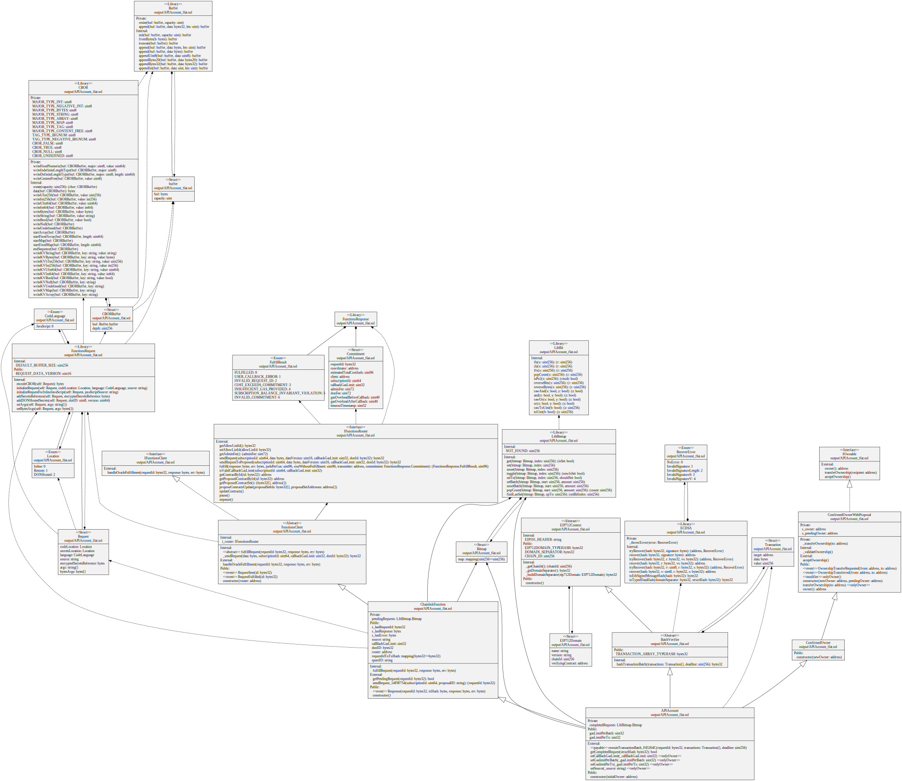

# API Account
[![Foundry][foundry-badge]][foundry]

[foundry]: https://getfoundry.sh
[foundry-badge]: https://img.shields.io/badge/Built%20with-Foundry-FFDB1C.svg

## API Account workflow

This set of contracts allows an API to own an account on EVM networks.

This account is represented as a contract following instructions from the given API responses. Off-chain API can execute on-chain transactions thanks to Chainlink Function product.

Javascript source file in `script/source.js` must return a 32 bytes typed domain hash containing necessary data for a batch of transactions to be executed by the API account. 

Responses are stored as pending requests which can be completed by calling `executeTransactionBatch_F45264C` method.

As an example a DAO can leverage Snapshot off-chain votes by making the execution of a sucessfull proposal trustless. The API account contract could hold some of the DAO's assets and executes a batch of transactions reviewed and voted by members.


## Installation

If you do not have Foundry yet, please install it:
```bash
curl -L https://foundry.paradigm.xyz | bash
foundryup
```

You can then build and test the smart-contracts:
```bash
npm i
make clean_build
```

## Smart-contract architecture

**Architecture Diagram:**

### API Account

